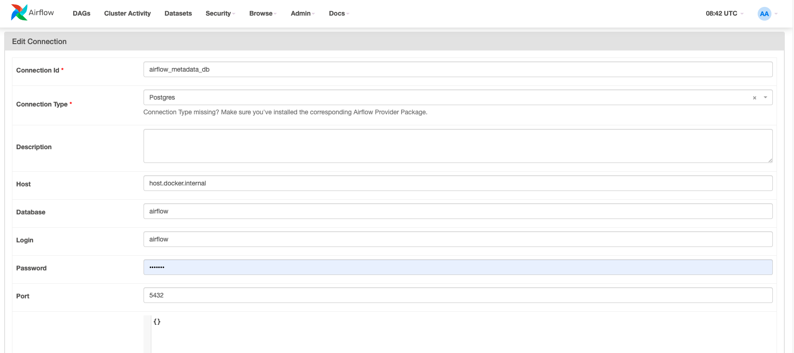
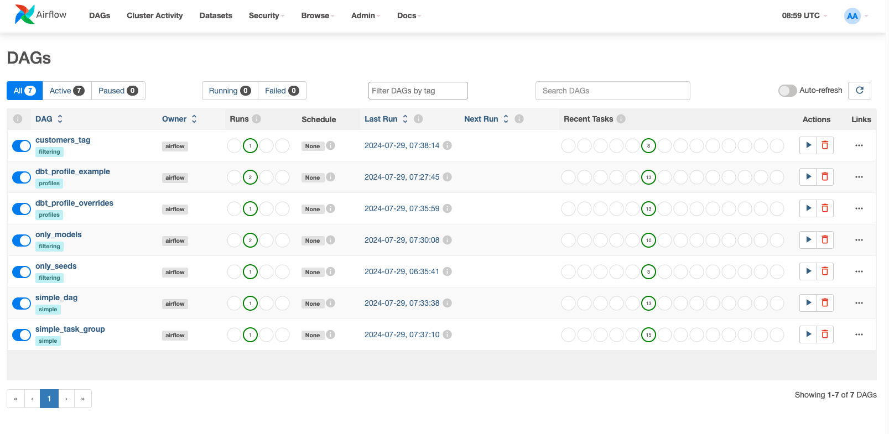

# cosmos-demo

## Prerequisites
1. Homebrew
2. git
3. Python 3.9 or higher
4. pip
5. Docker Desktop


## Environment Setup


1. Clone this repository
```bash
git clone https://github.com/snhou/cosmos-demo-without-astro-cli.git
```
2. Change into the `cosmos-demo-without-astro-cli` directory
```bash
cd cosmos-demo-without-astro-cli
``` 

3. Install virtual environment
``` bash
python3 -m venv venv
```
4. Enter into venv
```bash
source venv/bin/activate
```

5. Update pip
```bash
python3 -m pip install --upgrade pip
```

6. Install dependencies
```bash
python3 -m pip install -r requirements.txt
```
7. docker pull airflow image
```bash
docker pull apache/airflow:2.9.2
```
8. Open Docker Desktop and run docker-compose.yaml
```bash
docker compose build
```
```bash
docker compose up -d
```


## Aiflow Connection Setup

1. Connect to postgres

* Admin > Connections


```
Connection Id : airflow_metadata_db
Connection Type : Postgres
Host : host.docker.internal
Database : airflow
Login : airflow
Password : airflow
Port : 5432
```

2. Trigger DAGs

* DAGs > Actions(trigger)



## Install pgcli to connect Postgres
1. Use brew to install
```
brew install pgcli
```

2. Use pgcli to connect postgres db
```
pgcli -h localhost -p 5432 -u airflow
```
* pwd:airflow

## Using command to check schema and tables

* Clear window
```
\! clear
```

* List database
```
\l
```

* List tables
```
\dt
```
* List all table, view, 
```
\z
```


* list schema names
```
\dn
```

* Show now schema
```
SHOW SEARCH_PATH;
```

* Change schema
```
SET search_path TO {schema name}
```
